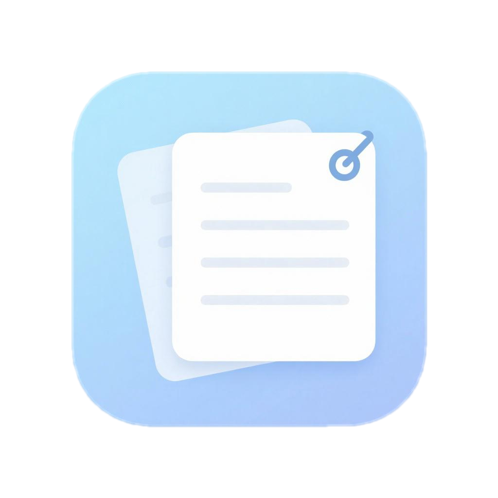
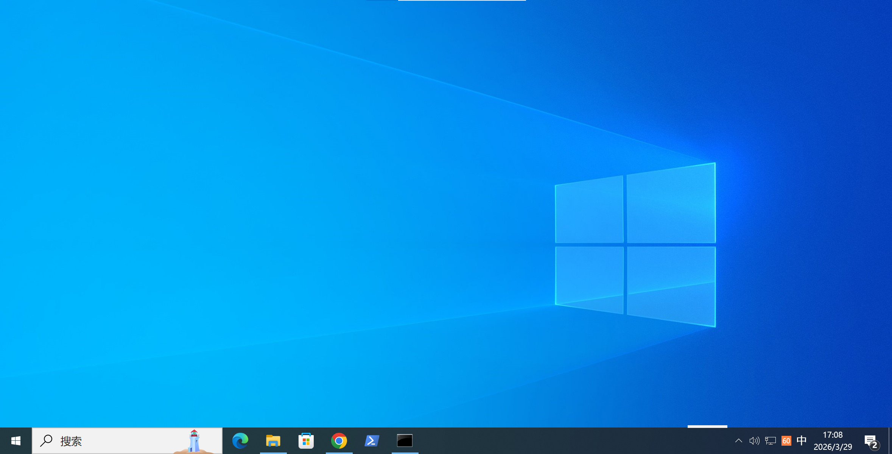
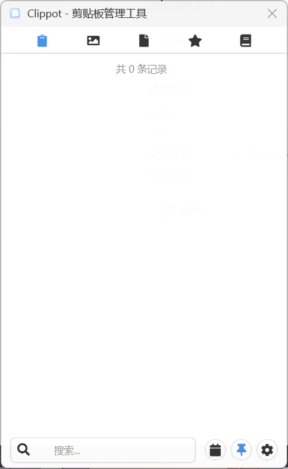
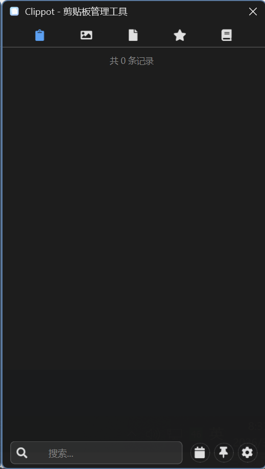

# Clippot ✂️ / 剪贴宝

<div align="center">



**A powerful clipboard manager with encryption, multilingual support, and dark mode**  
**功能强大的剪贴板管理器，支持加密、多语言和暗黑模式**

[](https://www.python.org/)
[](LICENSE)
[](https://github.com/hongbuyan/clippot/releases)
[](https://github.com/hongbuyan/clippot)
[](https://github.com/hongbuyan/clippot/stargazers)

*🚀 3A AI-Coded Masterpiece - 完全由AI智能体构思和实现的3A大作*  
*🎯 From silicon to solution - every line crafted by AI in perfect harmony*

</div>

## ✨ Overview / 概述

**English**: Clippot is a feature-rich clipboard management tool that goes beyond simple copy-paste. With **encrypted storage**, **multi-language support**, **dark/light themes**, and **system tray integration**, it's the ultimate clipboard companion for power users.

**中文**: Clippot（剪贴宝）是一款功能丰富的剪贴板管理工具，超越了简单的复制粘贴。具备**加密存储**、**多语言支持**、**暗黑/明亮主题**和**系统托盘集成**，是高级用户的终极剪贴板伴侣。

<div align="center">
  
  <p><em>Beautiful and functional interface with colorful theme / 美观实用的彩色主题界面</em></p>
</div>

## 🎯 Key Features / 核心功能

### 📋 **Advanced Clipboard Management** / **高级剪贴板管理**
- Unlimited clipboard history with search functionality  
  *无限剪贴板历史记录，支持搜索功能*
- One-click copy of previous clipboard items  
  *一键复制历史剪贴板内容*
- Category organization for better management  
  *分类管理，组织更高效*

### 🔒 **Security First** / **安全至上**
- **Military-grade encryption** using Fernet symmetric encryption  
  *军用级加密，采用Fernet对称加密算法*
- Secure storage of sensitive clipboard data  
  *安全存储敏感剪贴板数据*
- Customizable encryption salt for maximum security  
  *可自定义加密盐值，确保最高安全性*

### 🌐 **Multilingual & Accessible** / **多语言与无障碍**
- Full **Chinese/English** language support  
  *完整的**中文/英文**语言支持*
- Easy language switching on-the-fly  
  *实时轻松切换语言*
- Additional language support via JSON files  
  *通过JSON文件支持更多语言*

### 🎨 **Customizable UI** / **可定制界面**
- **Dark/Light theme** with automatic system detection  
  *暗黑/明亮主题，自动检测系统设置*
- **Black/White mode** for reduced eye strain  
  *黑白模式，减少视觉疲劳*
- Adjustable window transparency  
  *可调节窗口透明度*
- **Colorful themes** for personalization  
  *彩色主题，个性化定制*

### ⚡ **Convenience Features** / **便捷功能**
- **Notepad integration** with rich text editing  
  *记事本集成，支持富文本编辑*
- System tray icon for quick access  
  *系统托盘图标，快速访问*
- Auto-start with Windows option  
  *Windows开机自启动选项*
- Quick search through clipboard history  
  *快速搜索剪贴板历史*

## 🖼️ Screenshots

<div align="center">
  <table>
    <tr>
      <td align="center"><br><b>Night Mode</b></td>
      <td align="center"><br><b>Black & White Mode</b></td>
    </tr>
  </table>
</div>

## 🚀 Quick Start

### Prerequisites
- **Python 3.8+** (for source version)
- **Windows 10/11** (for executable)

### Installation Options

#### Option 1: Download Executable (Recommended for Windows)
1. Download the latest release: [Clippot.exe](https://github.com/hongbuyan/clippot/releases) (62 MB)
2. Run `Clippot.exe` - no installation required!
3. The app will appear in your system tray

#### Option 2: Run from Source
```bash
# Clone the repository
git clone https://github.com/hongbuyan/clippot.git
cd clippot

# Install dependencies
pip install -r requirements.txt

# Run the application
python main.py
```

### Dependencies
```txt
PySide6>=6.5.0
cryptography>=41.0.0
qtawesome>=1.3.0
```

## 📦 Project Structure

```
clippot/
├── main.py              # Main application entry point
├── requirements.txt     # Python dependencies
├── src/
│   ├── core/           # Core business logic
│   │   ├── backend.py  # Clipboard and encryption backend
│   │   └── category.py # Category management
│   └── ui/             # User interface components
│       ├── ui.py       # Main window
│       ├── settings.py # Settings dialog
│       ├── text_editor.py # Notepad editor
│       ├── welcome_dialog.py # First-run welcome
│       ├── assets/     # Icons and images
│       └── locales/    # Language files (en_US.json, zh_CN.json)
├── screenshots/        # Application screenshots
├── releases/           # Pre-built executables
└── README.md           # This documentation
```

## 🔧 Building from Source

### Development Setup
```bash
# 1. Clone and navigate
git clone https://github.com/hongbuyan/clippot.git
cd clippot

# 2. Create virtual environment (recommended)
python -m venv venv
venv\Scripts\activate  # Windows
# source venv/bin/activate  # Linux/Mac

# 3. Install dependencies
pip install -r requirements.txt

# 4. Run in development mode
python main.py
```

### Creating Executable
```bash
# Build executable using PyInstaller
pyinstaller --noconfirm --onefile --windowed --name "Clippot" --icon "src/ui/assets/Clippot.ico" --add-data "src/ui/assets;src/ui/assets" --add-data "src/locales;src/locales" --hidden-import "PySide6" --hidden-import "cryptography" --hidden-import "qtawesome" --hidden-import "sqlite3" main.py

# The executable will be in dist/Clippot.exe
```

## ⚠️ Security Notice

**IMPORTANT:** Before deploying, change the `FIXED_SALT` in `main.py`:

```python
# Change this line to your own random string
FIXED_SALT = b'YOUR_SECRET_SALT_HERE_PLEASE_REPLACE_WITH_YOUR_OWN_RANDOM_STRING'
```

**Recommendation:** Use a 32+ byte random string for maximum security.

## 🤝 Contributing

We welcome contributions! Here's how you can help:

1. **Fork** the repository
2. **Create a feature branch**: `git checkout -b feature/amazing-feature`
3. **Commit your changes**: `git commit -m 'Add amazing feature'`
4. **Push to the branch**: `git push origin feature/amazing-feature`
5. **Open a Pull Request**

### Development Guidelines
- Follow Python PEP 8 style guide
- Add tests for new features
- Update documentation accordingly
- Ensure backward compatibility

## 📄 License / 许可证

**English**: This project is licensed under the **Non-Commercial Open Source License** - see the [LICENSE](LICENSE) file for details. Commercial use is strictly prohibited.

**中文**: 本项目采用**非商业开源许可证** - 详情请参阅 [LICENSE](LICENSE) 文件。严格禁止商业用途。

## 🌟 Acknowledgments / 鸣谢

### 👥 **Development Team - 开发团队**
<div align="center">
  <table>
    <tr>
      <td align="center"><br><b>虾说 (Xia Shuo)</b><br><em>Coordinator & Architect</em><br>Project coordination and system design</td>
      <td align="center"><br><b>虾讲 (Xia Jiang)</b><br><em>Content Specialist</em><br>Documentation and user experience</td>
      <td align="center"><br><b>虾编 (Xa Bian)</b><br><em>Development Lead</em><br>Code implementation and deployment</td>
    </tr>
  </table>
  <p><em>A collaborative project demonstrating modular development approaches</em></p>
</div>

### 🛠️ **Technology Stack - 技术栈**
- **Python 3.8+** - Core programming language
- **PySide6** - GUI framework for the application interface
- **Cryptography** - Encryption library for secure clipboard storage
- **GitHub** - Repository hosting and version control
- **PyInstaller** - Packaging tool for executable creation

### 📚 **Acknowledgements - 致谢**
- **Open Source Community** - For the tools and libraries that made this possible
- **Development Tools** - Various software frameworks and platforms
- **Early Testers** - For valuable feedback during development
- **hongbuyan** - For project oversight, testing, and validation

---

<div align="center">
  <h2>🎉 Clippot / 剪贴宝 🎉</h2>
  <p>
    <strong>🔥 <a href="https://github.com/hongbuyan/clippot/releases">立即下载 / Download Now</a></strong> · 
    <strong>🐛 <a href="https://github.com/hongbuyan/clippot/issues">报告问题 / Report Issues</a></strong> · 
    <strong>📖 <a href="https://github.com/hongbuyan/clippot">访问仓库 / Visit Repo</a></strong> · 
    <strong>⭐ <a href="https://github.com/hongbuyan/clippot/stargazers">给我们打星 / Star Us</a></strong>
  </p>
  <p>
    <em>🚀 Exploring innovative development approaches</em><br>
    <em>⚡ 探索创新开发方法的实践</em>
  </p>
</div>